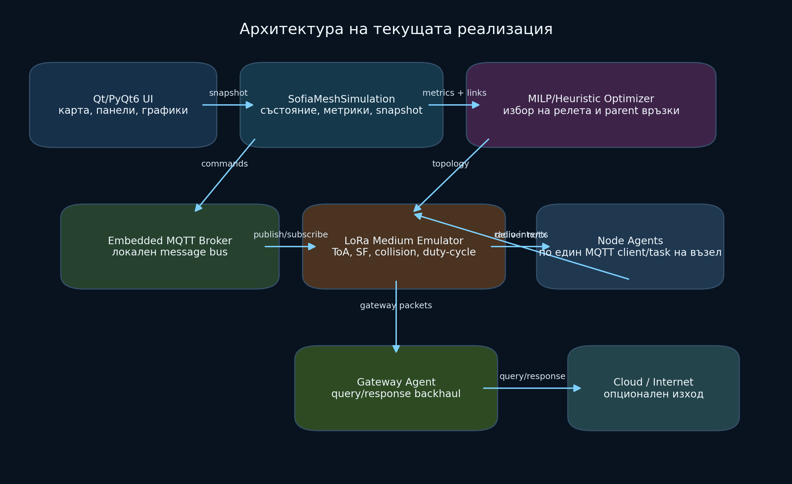
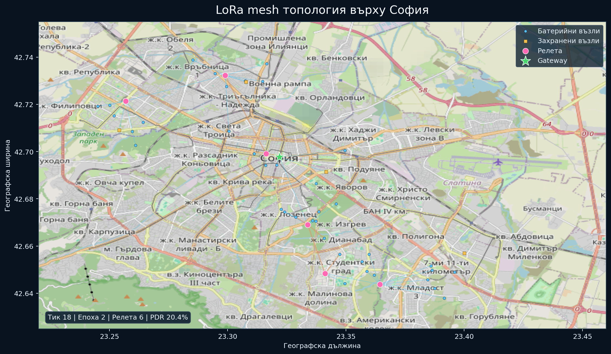
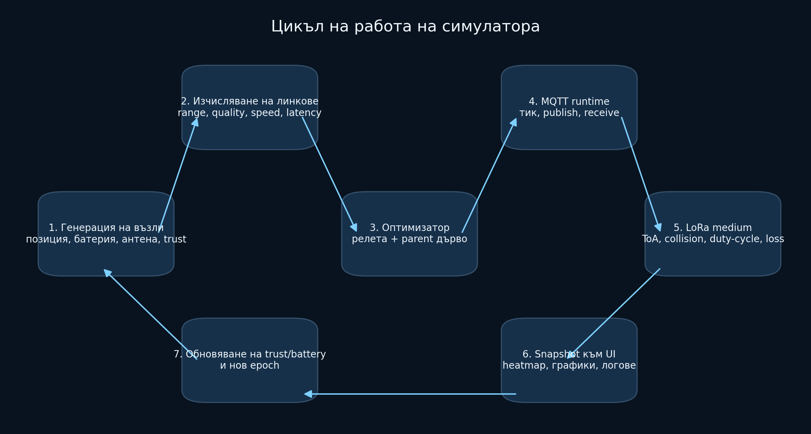
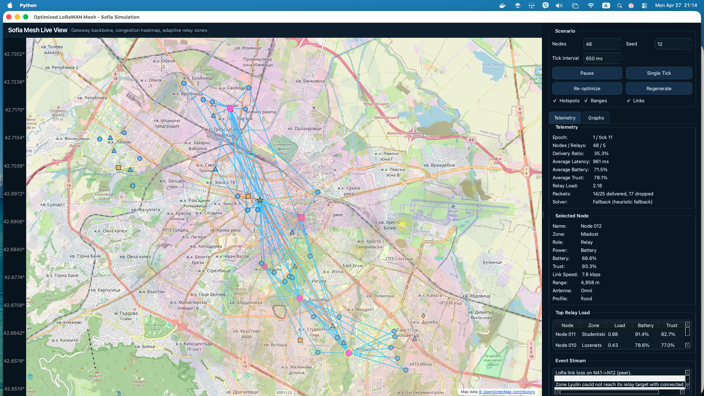
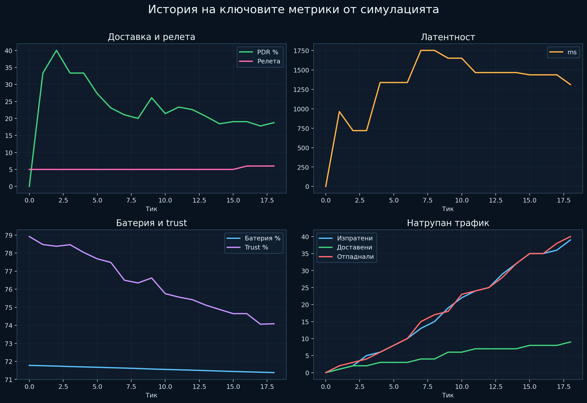

# IoT в социалните мрежи и свързаността

Антон Христов, 12б клас, №4 • Увод в IoT

## Оптимизирана LoRaWAN/LoRa Mesh симулация за градска среда с MQTT изпълнителен слой, модел на доверие и MILP избор на релета

### Съдържание

> [1. Увод](#1-увод)
>
> [2. Цел и обхват на разработката](#2-цел-и-обхват-на-разработката)
>
> [3. Теоретична основа](#3-теоретична-основа)
>
> [4. Обща архитектура на системата](#4-обща-архитектура-на-системата)
>
> [5. Пространствен модел и топология върху София](#5-пространствен-модел-и-топология-върху-софия)
>
> [6. Модел на възлите и комуникационните връзки](#6-модел-на-възлите-и-комуникационните-връзки)
>
> [7. MQTT изпълнителен слой и емулация на LoRa среда](#7-mqtt-изпълнителен-слой-и-емулация-на-lora-среда)
>
> [8. Оптимизационен модел за избор на релета](#8-оптимизационен-модел-за-избор-на-релета)
>
> [9. Цикъл на работа на симулатора](#9-цикъл-на-работа-на-симулатора)
>
> [10. Потребителски интерфейс и визуализация](#10-потребителски-интерфейс-и-визуализация)
>
> [11. Метрики и анализ на резултатите](#11-метрики-и-анализ-на-резултатите)
>
> [12. Ограничения на модела и степен на реализъм](#12-ограничения-на-модела-и-степен-на-реализъм)
>
> [13. Заключение](#13-заключение)
>
> [Литературни източници](#литературни-източници)

# 1. Увод

Интернетът на нещата (IoT) обединява голям брой физически устройства, които събират, обменят и обработват данни при ограничени енергийни и комуникационни ресурси. В контекста на умните градове това включва сензори за качество на въздуха, трафик, осветление, паркиране, хидрологични параметри и други инфраструктурни елементи. При подобни системи често възниква необходимост от комуникация на големи разстояния, ниска консумация на енергия и устойчивост при частична липса на мрежова инфраструктура.

LoRa и LoRaWAN са широко използвани технологии в тази област поради ниската консумация и възможността за предаване на малки обеми данни на значителни разстояния. Класическият LoRaWAN модел обаче е предимно ориентиран около централен шлюз и еднохопова комуникация, което ограничава покритието и натоварва крайните възли в периферията на мрежата. Поради това многохоповите и mesh подходите представляват важна посока за разширяване на обхвата и повишаване на устойчивостта.

Паралелно с това, в научната литература се развива и концепцията за Social Internet of Things (SIoT), при която устройствата не се разглеждат само като изолирани комуникационни възли, а като обекти с профил, доверие, принадлежност към общности и поведенчески характеристики. Този подход е приложим при избор на релета, маршрутизация, контрол на натоварването и оценка на надеждността.

Настоящият проект представлява софтуерна симулационна среда за градска LoRa mesh мрежа върху карта на София. Реализацията съчетава географско разполагане на възли, оптимизационен модел за избор на релета, локален MQTT изпълнителен слой и визуален интерфейс за наблюдение на трафик, натоварване и състояние на мрежата.

# 2. Цел и обхват на разработката

Основната цел на разработката е създаване на интерактивен симулатор, който демонстрира поведението на градска LoRa mesh мрежа с приблизително 100 разнородни възела, разположени върху картата на София.

В рамките на проекта са реализирани следните функционалности:

- графична десктоп среда с карта, телеметрия и графики;
- пространствен модел на възлите върху реалистична градска област;
- възли с различни режими на захранване, различен обхват, различна скорост и различен тип антена;
- модел на доверие, натоварване и справедливо разпределение на relay ролите;
- отделен оптимизационен модул за избор на релета;
- локален MQTT изпълнителен слой с асинхронни агенти за устройствата;
- емулация на LoRa среда с доставка на пакети, сблъсъци, duty-cycle ограничения и латентност;
- логика на шлюз за заявки и отговори към външен комуникационен слой.

Обхватът на разработката е учебно-инженерен. Системата е предназначена за анализ на архитектурни зависимости, демонстрация на алгоритми и сравнение на стратегии, а не за директна замяна на физически радио симулатор на ниво лабораторна точност.

# 3. Теоретична основа

LoRaWAN е LPWAN технология, която осигурява ниска консумация и голям обхват, но по подразбиране следва еднохопов модел на комуникация. Изследванията върху LoRa mesh показват, че при многохопова архитектура може да се постигне по-добро покритие и по-висок коефициент на доставка на пакети за възли, които са далеч от шлюза [1], [2], [3].

В същото време SIoT моделите предлагат механизми за използване на доверие, принадлежност и поведенчески индикатори при организиране на комуникацията между устройствата [4], [6], [7]. В инженерна среда това означава, че изборът на реле не следва да зависи само от геометричното разстояние, а и от състоянието на батерията, историята на натоварване и надеждността на устройството.

В настоящата разработка тези две линии са комбинирани: LoRa mesh се използва като мрежова основа, а моделът за доверие и справедливост се включва в логиката за избор на релета чрез MILP-подобен оптимизационен модел.

# 4. Обща архитектура на системата



Фиг. 1. Архитектурна схема на реализираната система.

Системата е разделена на няколко основни слоя.

## 4.1. Координиращ симулационен слой

Координиращият слой управлява общото състояние на мрежата. Той генерира възлите, пресмята връзките, извиква оптимизационния модул, стартира MQTT изпълнителния слой и създава моментни състояния за визуализация.

## 4.2. Оптимизационен модул

Оптимизационният модул изпълнява избор на релета и родителски връзки чрез MILP-подобен модел с евристичен резервен механизъм. Той работи независимо от потребителския интерфейс, което позволява логиката да бъде анализирана и модифицирана отделно.

## 4.3. MQTT изпълнителен слой

Реализиран е локален вграден MQTT broker. Всеки възел се представя от собствен асинхронен агент, който се свързва към broker-а, получава управляващи съобщения и публикува пакети за предаване.

## 4.4. Емулатор на LoRa среда

Между възлите и broker слоя е реализиран специализиран емулатор на радиосредата. Неговата задача е да емулира типични характеристики на LoRa комуникацията: ограничен ефир, приблизително време в ефир, сблъсъци, duty-cycle ограничения и вероятностни отпадания на пакети.

## 4.5. Потребителски интерфейс

Графичният интерфейс е реализиран с PyQt6 и `pyqtgraph-gis`. Интерфейсът визуализира картата, възлите, зоните на релетата, натоварването, журнала на събитията и историята на ключовите метрики.

# 5. Пространствен модел и топология върху София

Симулацията използва карта на София като реалистичен географски контекст. Възлите се разполагат около няколко предварително зададени градски зони:

- Lyulin
- Nadezhda
- Center
- Lozenets
- Studentski
- Mladost

Всеки възел получава позиция чрез случайно отклонение около централна точка на своята зона. По този начин се създават клъстери, които наподобяват градско разпределение на сензори и крайни устройства.



Фиг. 2. Примерна топология на симулацията върху София.

На фигурата се различават:

- шлюз;
- релета;
- батерийни крайни възли;
- външно захранени възли;
- гръбначни връзки на мрежата;
- активни връзки с текущ трафик;
- heatmap на натоварването.

Пространственият модел влияе пряко върху качеството на комуникацията, тъй като от разстоянието и ориентацията на антените зависят използваемият обхват, качеството на връзката, надеждността и латентността на всяка връзка.

# 6. Модел на възлите и комуникационните връзки

Всеки възел се описва чрез набор от параметри, които определят неговото поведение в мрежата:

- географска позиция;
- режим на захранване: `battery` или `plugged`;
- ниво на батерия;
- trust score;
- скорост на предаване;
- радиус на комуникация;
- функция на затихване с разстоянието;
- форма на антената: кръгова или секторна;
- посока и ширина на излъчване;
- профил на сензора;
- интензитет на трафика (`traffic_bias`);
- история на участие като реле.

Линковете между възлите не са предварително фиксирани. За всяка двойка участници се оценяват:

- географско разстояние;
- използваем обхват;
- качество на връзката;
- ефективна скорост;
- надеждност;
- енергийна цена;
- latency.

При секторните антени се взема предвид ориентацията на лъча. По този начин мрежата не е симетрична и не всеки възел има еднакви възможности във всички посоки. Това е съществено за избора на релета и за формата на гръбначната структура на мрежата.

За обновяване на доверието се използва изглаждане от вида:

```math
t_i^{new} = \alpha t_i^{old} + (1 - \alpha) \hat{t}_i
```

където `\hat{t}_i` е текущата оценка за надеждно или ненадеждно поведение на възела. Този механизъм позволява на системата да реагира на промени, без да губи напълно натрупаната историческа информация.

# 7. MQTT изпълнителен слой и емулация на LoRa среда

Съществена особеност на проекта е, че комуникацията не се моделира само като вътрешни програмни извиквания. Вместо това е изграден изпълнителен слой върху локален MQTT broker.

Използваните логически топици са:

- `mesh/control/tick` – начало на симулационен тик;
- `mesh/control/node/<id>` – публикуване на обновявания на топологията и ролите на релетата;
- `mesh/tx/<id>` – заявка за предаване от възел;
- `mesh/rx/<id>` – доставка на пакет до възел.

Тази организация позволява всеки възел да се държи като самостоятелен агент. По този начин архитектурата е по-близка до реална разпределена система, в която компонентите обменят съобщения през broker, а не чрез директен достъп до общо състояние.

Важно е да се отбележи, че MQTT не играе ролята на радио протокол. Реалистичният комуникационен слой се реализира от емулатора на LoRa среда, който обработва публикуваните за предаване пакети.

В емулацията се вземат предвид:

- приблизителен избор на spreading factor според качеството на връзката;
- приблизителна оценка на bandwidth и coding rate;
- зависимост от времето в ефир;
- скалирана латентност за интерактивна визуализация;
- duty-cycle блокиране при твърде чести предавания;
- сблъсъци между предавания със съвпадащи характеристики към един и същ приемник;
- вероятностно отпадане на пакет при неблагоприятни условия.

Опростена оценка на времето на символ е:

```math
T_{sym} \approx \frac{2^{SF}}{BW}
```

Върху тази основа се извежда приблизително време в ефир, което след това се използва за оценка на ефирната цена на пакета. Времето в симулатора е скалирано с цел удобна работа на десктоп приложението, но относителната зависимост между по-висок SF, по-голяма латентност и по-висока цена се запазва.

# 8. Оптимизационен модел за избор на релета

Изборът на релета е формулиран като комбинаторна оптимизационна задача. На концептуално ниво се използват бинарни променливи:

- `x_i` – дали възел `i` е реле;
- `y_{ij}` – дали възел `i` използва `j` като next hop.

Целевата функция е:

```math
\min \sum_i c_i x_i + \lambda \sum_{i,j} d_{ij} y_{ij}
```

където:

- `c_i` представлява цена за избора на възел като реле;
- `d_{ij}` представлява цена на линка между възли `i` и `j`.

В цената на релеен възел се включват фактори като:

- режим на захранване;
- остатъчна батерия;
- доверие;
- наказание за несправедливо натрупване на relay роля;
- текущо натоварване;
- предимства от по-висок обхват и по-висока скорост.

В цената на линка се включват:

- загуба от ниско качество на връзката;
- наказание при ниска скорост;
- наказание при ниска надеждност;
- енергийна цена;
- допълнителна цена за директна връзка към шлюза.

Основните ограничения в модела са:

- всеки възел избира точно един родителски възел или директна връзка към шлюза;
- възел не може да бъде използван като родител, ако не е избран за реле;
- броят на възлите, обслужвани от едно реле, е ограничен;
- във всяка зона се поддържа минимален и максимален брой релета.

В практическата реализация MILP решението не винаги е допустимо при всички пространствени и комуникационни ограничения. Поради това при нужда се използва евристичен резервен механизъм, който изгражда свързана гръбначна структура на мрежата с отчитане на наличната свързаност. Този подход осигурява работоспособност на системата и позволява симулацията да продължи и при трудни топологии.

# 9. Цикъл на работа на симулатора



Фиг. 3. Обобщен цикъл на работа на симулацията.

Работният цикъл на симулатора може да се раздели на следните стъпки:

1. Инициализация или регенериране на възлите.
2. Изчисляване на потенциалните комуникационни връзки.
3. Избор на релета и родителска структура.
4. Публикуване на управляващи съобщения към възловите агенти.
5. Генериране на трафик от крайните възли.
6. Обработка на предаванията в емулатора на LoRa среда.
7. Обновяване на батерия, trust, броячи и журнал на събитията.
8. Създаване на ново моментно състояние за визуализация.

Симулацията е организирана по тикове и епохи. На всеки тик се обработва текущият трафик, а на определен брой тикове се извършва нова оптимизационна епоха. При влошаване на състоянието на релетата може да се направи и извънредна преоптимизация.

# 10. Потребителски интерфейс и визуализация

Потребителският интерфейс е разработен като десктоп приложение с два основни дяла:

- карта на София в лявата част;
- контролен и аналитичен панел в дясната част.



Фиг. 4. Работещо приложение с активна симулация, карта, relay връзки, карта на натоварването, телеметрия и журнал на събитията.

Върху картата се визуализират:

- възлите и шлюзовото устройство;
- формата и обхватът на антените;
- relay зони;
- гръбначните връзки на мрежата;
- активните връзки с текущ трафик;
- heatmap на натоварването.

В десния панел са достъпни:

- контрол на параметрите на сценария;
- телеметрични стойности за текущото състояние;
- детайли за избран възел;
- таблица с най-натоварените релета;
- поток от събития;
- таб с графики на историята на основните метрики.

Тази организация позволява едновременно качествено наблюдение на топологията и количествен анализ на поведението на мрежата във времето.

# 11. Метрики и анализ на резултатите



Фиг. 5. История на основни метрики в примерен симулационен сценарий.

В проекта се следят следните основни показатели:

- брой релета;
- коефициент на доставка на пакети;
- средна латентност;
- средно ниво на батерия;
- средно ниво на trust;
- общ брой изпратени, доставени и отпаднали пакети;
- сумарно натоварване на релетата.

Интерпретацията на тези метрики позволява да се правят изводи относно:

- качеството на покритието;
- устойчивостта на избраната гръбначна структура на мрежата;
- цената на многохоповата комуникация;
- влиянието на натоварването върху вероятността за доставка;
- ефекта от ротацията на relay ролите върху енергийния баланс.

При намаляване на PDR и повишаване на латентността при стабилен брой релета е вероятно мрежата да навлиза в зона на претоварване или деградация на връзките. При бързо понижаване на батерията на relay възлите е необходима по-честа преоптимизация или по-силно наказание за несправедливо натрупване на relay роля в целевата функция.

# 12. Ограничения на модела и степен на реализъм

Разработеният симулатор предоставя правдоподобен инженерен модел, но не следва да се разглежда като пълна физическа емулация на LoRaWAN стек.

Сравнително реалистично са моделирани:

- пространствено разположение на възлите;
- разнороден хардуерен профил;
- ориентирни ефекти на насочени и ненасочени антени;
- деградация на качеството с разстоянието;
- ротация на релетата, доверие и справедливо разпределение;
- duty-cycle блокиране и логика за сблъсъци;
- поведение на ниво пакети през локален broker и независими агенти.

Опростени остават следните аспекти:

- липсва пълна физическа калибрация на RSSI/SNR модели;
- липсва детайлен модел на затихване от сгради и релеф за София;
- няма пълна LoRaWAN MAC имплементация;
- няма нормативно точен регионален duty-cycle модел;
- времето в ефир и адаптацията на връзките са приближени, а не хардуерно калибрирани.

Следователно системата е подходяща за:

- демонстрация на архитектура;
- анализ на алгоритми и стратегии;
- визуализация на компромиси между енергия, надеждност и латентност;
- учебни и курсови цели.

Системата не е достатъчна самостоятелно за:

- точни твърдения за физически обхват на конкретен хардуер;
- финални оценки на батериен живот в реална среда;
- публикуване на физически валидирани радио резултати без допълнителна калибрация.

# 13. Заключение

Разработеният проект представлява цялостна симулационна платформа за анализ и визуализация на градска LoRa mesh мрежа. Системата обединява географски контекст, оптимизационна логика, механизми за доверие и справедливост, MQTT изпълнителен слой и интерактивен потребителски интерфейс.

Особен принос на реализацията е ясното разделяне между:

- логика за избор на релета;
- изпълнителен комуникационен слой;
- емулация на радиосреда;
- визуализация и анализ.

По този начин проектът дава добра основа както за учебно представяне на LoRa mesh архитектури, така и за бъдещо развитие към по-реалистични радио модели, външен broker, hardware-in-the-loop тестове или интеграция с реални устройства.

# Литературни източници

#### [1] Durand, T.G.; Booysen, M.J. Performance Evaluation of a Mesh-Topology LoRa Network. Sensors 2025, 25, 1602. [линк](https://doi.org/10.3390/s25051602)

#### [2] Berto, R.; Napoletano, P.; Savi, M. A LoRa-Based Mesh Network for Peer-to-Peer Long-Range Communication. Sensors 2021, 21, 4314. [линк](https://doi.org/10.3390/s21134314)

#### [3] Arregui Almeida, D.; et al. Gateway-Free LoRa Mesh on ESP32: Design, Self-Healing Mechanisms, and Empirical Performance. Sensors 2025, 25, 6036. [линк](https://doi.org/10.3390/s25196036)

#### [4] Aldelaimi, M.N.; Hossain, M.A.; Alhamid, M.F. Building Dynamic Communities of Interest for Internet of Things in Smart Cities. Sensors 2020, 20, 2986. [линк](https://doi.org/10.3390/s20102986)

#### [5] Premsankar, G.; et al. Optimal Configuration of LoRa Networks in Smart Cities. 2020. [линк](https://doi.org/10.1109/TII.2020.2967123)

#### [6] Patil, D.A.; Shyamala, G. A comprehensive survey on securing the social internet of things: protocols, threat mitigation, technological integrations, tools, and performance metrics. Scientific Reports 2025. [линк](https://www.nature.com/articles/s41598-025-23865-4)

#### [7] Zhang, C.; et al. Trust Attacks and Defense in the Social Internet of Things: Taxonomy and Simulation-Based Evaluation. Sensors 2025, 25, 7513. [линк](https://doi.org/10.3390/s25247513)
